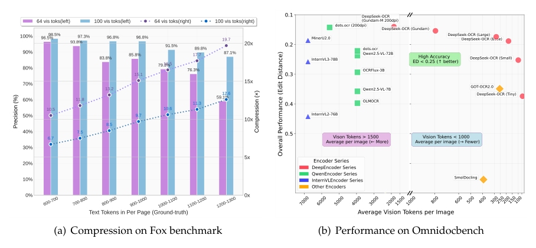
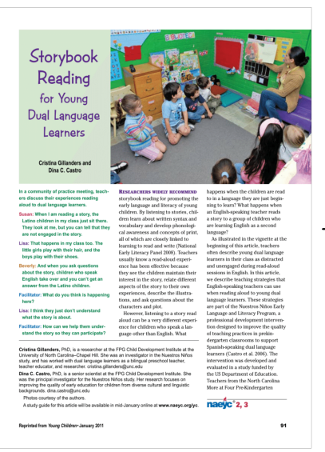
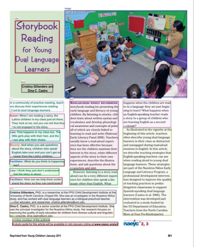
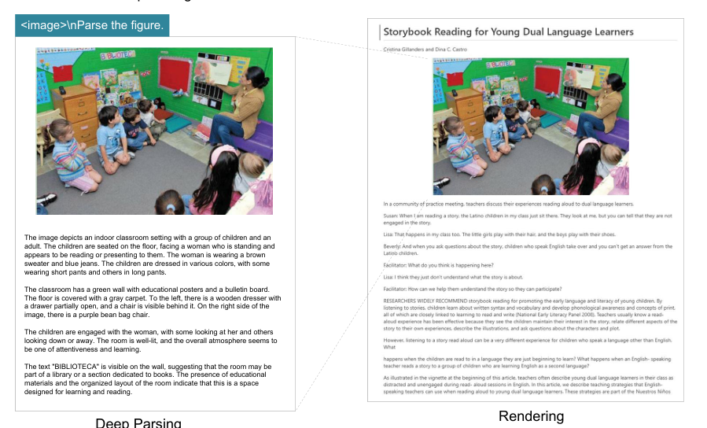
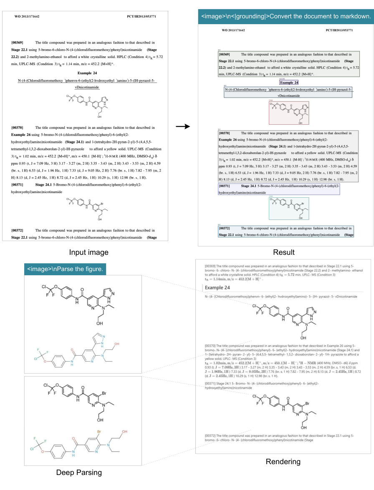
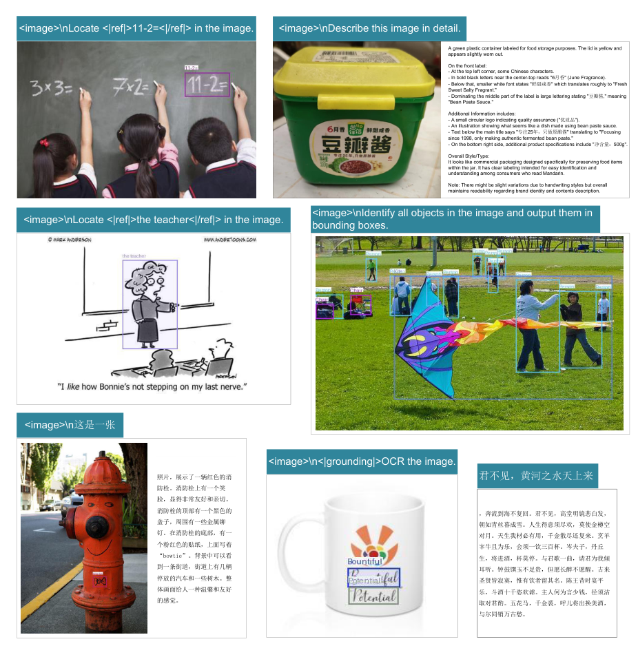
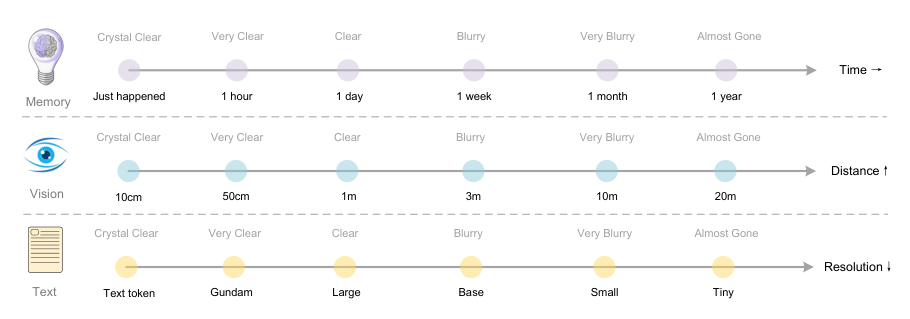

<!-- Page 1 -->
<!-- Page image stored at images/page-001.png -->

# DeepSeek-OCR: Contexts Optical Compression 

Haoran Wei, Yaofeng Sun, Yukun Li 

DeepSeek- AI 

## Abstract 

We present DeepSeek- OCR as an initial investigation into the feasibility of compressing long contexts via optical 2D mapping. DeepSeek- OCR consists of two components: DeepEncoder and DeepSeek3B- MoE- A570M as the decoder. Specifically, DeepEncoder serves as the core engine, designed to maintain low activations under high- resolution input while achieving high compression ratios to ensure an optimal and manageable number of vision tokens. Experiments show that when the number of tokens is within 10 times that of vision tokens (i.e., a compression ratio \(< 10\times\) ), the model can achieve decoding (OCR) precision of \(97\%\) . Even at a compression ratio of \(20\times\) , the OCR accuracy still remains at about \(60\%\) . This shows considerable promise for research areas such as historical long- context compression and memory forgetting mechanisms in LLMs. Beyond this, DeepSeek- OCR also demonstrates high practical value. On OmniDocBench, it surpasses GOT- OCR2.0 (256 tokens/page) using only 100 vision tokens, and outperforms MinerU2.0 ( \(6000+\) tokens per page on average) while utilizing fewer than 800 vision tokens. In production, DeepSeek- OCR can generate training data for LLMs/VLMs at a scale of \(200k+\) pages per day (a single A100- 40G). Codes and model weights are publicly accessible at http://github.com/deepseek- ai/DeepSeek- OCR. 

Figure 1 | Figure (a) shows the compression ratio (number of tokens in ground truth/number of vision tokens model used) testing on Fox benchmark; Figure (b) shows performance comparisons on OmniDocBench . DeepSeek-OCR can achieve state-of-the-art performance among end-to-end models enjoying the fewest vision tokens. 

<!-- Page 2 -->
<!-- Page image stored at images/page-002.png -->

## Contents 

1 Introduction 3 

2 Related Works 4 

2.1 Typical Vision Encoders in VLMs 4 

2.2 End-to-end OCR Models 4 

3 Methodology 5 

3.1 Architecture 5 

3.2 DeepEncoder 5 

3.2.1 Architecture of DeepEncoder 5 

3.2.2 Multiple resolution support 6 

3.3 The MoE Decoder 7 

3.4 Data Engine 7 

3.4.1 OCR 1.0 data 7 

3.4.2 OCR 2.0 data 8 

3.4.3 General vision data 9 

3.4.4 -only data 9 

3.5 Training Pipelines 9 

3.5.1 Training DeepEncoder 10 

3.5.2 Training DeepSeek- OCR 10 

4 Evaluation 10 

4.1 Vision- Compression Study 10 

4.2 OCR Practical Performance 12 

4.3 Qualitative Study 12 

4.3.1 Deep parsing 12 

4.3.2 Multilingual recognition 16 

4.3.3 General vision understanding 17 

5 Discussion 18 

6 Conclusion 19

<!-- Page 3 -->
<!-- Page image stored at images/page-003.png -->

## 1. Introduction 

Current Large Language Models (LLMs) face significant computational challenges when processing long textual content due to quadratic scaling with sequence length. We explore a potential solution: leveraging visual modality as an efficient compression medium for textual information. A single image containing document can represent rich information using substantially fewer tokens than the equivalent digital , suggesting that optical compression through vision tokens could achieve much higher compression ratios. 

This insight motivates us to reexamine vision- language models (VLMs) from an LLM- centric perspective, focusing on how vision encoders can enhance LLMs' efficiency in processing textual information rather than basic VQA what humans excel at. OCR tasks, as an intermediate modality bridging vision and language, provide an ideal testbed for this vision- compression paradigm, as they establish a natural compression- decompression mapping between visual and textual representations while offering quantitative evaluation metrics. 

Accordingly, we present DeepSeek- OCR, a VLM designed as a preliminary proof- of- concept for efficient vision- compression. Our work makes three primary contributions: 

First, we provide comprehensive quantitative analysis of vision- token compression ratios. Our method achieves \(96\% +\) OCR decoding precision at \(9 - 10\times\) compression, \(\sim 90\%\) at \(10 - 12\times\) compression, and \(\sim 60\%\) at \(20\times\) compression on Fox benchmarks featuring diverse document layouts (with actual accuracy being even higher when accounting for formatting differences between output and ground truth), as shown in Figure 1(a). The results demonstrate that compact language models can effectively learn to decode compressed visual representations, suggesting that larger LLMs could readily acquire similar capabilities through appropriate pretraining design. 

Second, we introduce DeepEncoder, a novel architecture that maintains low activation memory and minimal vision tokens even with high- resolution inputs. It serially connects window attention and global attention encoder components through a \(16\times\) convolutional compressor. This design ensures that the window attention component processes a large number of vision tokens, while the compressor reduces vision tokens before they enter the dense global attention component, achieving effective memory and token compression. 

Third, we develop DeepSeek- OCR based on DeepEncoder and DeepSeek3B- MoE . As shown in Figure 1(b), it achieves state- of- the- art performance within end- to- end models on OmniDocBench while using the fewest vision tokens. Additionally, we equip the model with capabilities for parsing charts, chemical formulas, simple geometric figures, and natural images to enhance its practical utility further. In production, DeepSeek- OCR can generate 33 million pages of data per day for LLMs or VLMs using 20 nodes (each with 8 A100- 40G GPUs). 

In summary, this work presents a preliminary exploration of using visual modality as an efficient compression medium for textual information processing in LLMs. Through DeepSeek- OCR, we demonstrate that vision- compression can achieve significant token reduction (7- 20x) for different historical context stages, offering a promising direction for addressing long- context challenges in large language models. Our quantitative analysis provides empirical guidelines for VLM token allocation optimization, while the proposed DeepEncoder architecture showcases practical feasibility with real- world deployment capabilities. Although focused on OCR as a proof- of- concept, this paradigm opens new possibilities for rethinking how vision and language modalities can be synergistically combined to enhance computational efficiency in large- scale processing and agent systems.

<!-- Page 4 -->
<!-- Page image stored at images/page-004.png -->

Figure 2 | Typical vision encoders in popular VLMs. Here are three types of encoders commonly used in current open-source VLMs, all of which suffer from their respective deficiencies. 
 

## 2. Related Works 

### 2.1. Typical Vision Encoders in VLMs 

Current open- source VLMs employ three main types of vision encoders, as illustrated in Figure 2. The first type is a dual- tower architecture represented by Vary , which utilizes parallel SAM encoder to increase visual vocabulary parameters for high- resolution image processing. While offering controllable parameters and activation memory, this approach suffers from significant drawbacks: it requires dual image preprocessing that complicates deployment and makes encoder pipeline parallelism challenging during training. The second type is tile- based method exemplified by InternVL2.0 , which processes images by dividing them into small tiles for parallel computation, reducing activation memory under high- resolution settings. Although capable of handling extremely high resolutions, this approach has notable limitations due to its typically low native encoder resolution (below \(512 \times 512\) ), causing large images to be excessively fragmented and resulting in numerous vision tokens. The third type is adaptive resolution encoding represented by Qwen2- VL , which adopts the NaViT paradigm to directly process full images through patch- based segmentation without tile parallelization. While this encoder can handle diverse resolutions flexibly, it faces substantial challenges with large images due to massive activation memory consumption that can cause GPU memory overflow, and sequence packing requires extremely long sequence lengths during training. Long vision tokens will slow down both prefill and generation phases of inference. 

### 2.2. End-to-end OCR Models 

OCR, particularly document parsing task, has been a highly active topic in the image- to- domain. With the advancement of VLMs, a large number of end- to- end OCR models have emerged, fundamentally transforming the traditional pipeline architecture (which required separate detection and recognition expert models) by simplifying OCR systems. Nougat first employs end- to- end framework for academic paper OCR on arXiv, demonstrating the potential of models in handling dense perception tasks. GOT- OCR2.0 expands the scope of OCR2.0 to include more synthetic image parsing tasks and designs an OCR model with performance- efficiency trade- offs, further highlighting the potential of end- to- end OCR researches. Additionally, general vision models such as Qwen- VL series , InternVL series , and many their derivatives continuously enhance their document OCR capabilities to explore dense visual perception boundaries. However, a crucial research question that current models have not addressed is: for a document containing 1000 words, how many vision tokens are at least needed for decoding? This question holds significant importance for research in the principle that "a picture is worth a thousand words."

<!-- Page 5 -->
<!-- Page image stored at images/page-005.png -->

Figure 3 | The architecture of DeepSeek-OCR. DeepSeek-OCR consists of a DeepEncoder and a DeepSeek-3B-MoE decoder. DeepEncoder is the core of DeepSeek-OCR, comprising three components: a SAM for perception dominated by window attention, a CLIP for knowledge with dense global attention, and a \(16\times\) token compressor that bridges between them. 
 

## 3. Methodology 

### 3.1. Architecture 

As shown in Figure 3, DeepSeek- OCR enjoys a unified end- to- end VLM architecture consisting of an encoder and a decoder. The encoder (namely DeepEncoder) is responsible for extracting image features and tokenizing as well as compressing visual representations. The decoder is used for generating the required result based on image tokens and prompts. DeepEncoder is approximately 380M in parameters, mainly composed of an 80M SAM- base and a 300M CLIP- large connected in series. The decoder adopts a 3B MoE architecture with 570M activated parameters. In the following paragraphs, we will delve into the model components, data engineering, and training skills. 

### 3.2. DeepEncoder 

To explore the feasibility of contexts optical compression, we need a vision encoder with the following features: 1. Capable of processing high resolutions; 2. Low activation at high resolutions; 3. Few vision tokens; 4. Support for multiple resolution inputs; 5. Moderate parameter count. However, as described in the Section 2.1, current open- source encoders cannot fully satisfy all these conditions. Therefore, we design a novel vision encoder ourselves, named DeepEncoder. 

#### 3.2.1. Architecture of DeepEncoder 

DeepEncoder mainly consists of two components: a visual perception feature extraction component dominated by window attention, and a visual knowledge feature extraction component with dense global attention. To benefit from the pretraining gains of previous works, we use SAM- base (patch- size 16) and CLIP- large as the main architectures for the two components respectively. For CLIP, we remove the first patch embedding layer since its input is no longer images but output tokens from the previous pipeline. Between the two components, we borrow from Vary and use a 2- layer convolutional module to perform \(16\times\) downsampling of vision tokens. Each convolutional layer has a kernel size of 3, stride of 2, padding of 1, and channels increase from 256 to 1024. Assuming we input a \(1024\times 1024\) image, the DeepEncoder will segment it into \(1024 / 16\times 1024 / 16 = 4096\) patch tokens. Since the first half of encoder is dominated by window attention and only 80M, the activation is acceptable. Before entering global attention,

<!-- Page 6 -->
<!-- Page image stored at images/page-006.png -->

Figure 4 | To test model performance under different compression ratios (requiring different numbers of vision tokens) and enhance the practicality of DeepSeek-OCR, we configure it with multiple resolution modes. 
 

the 4096 tokens go through the compression module and the token count becomes \(4096 / 16 = 256\) , thus making the overall activation memory controllable. 

Table 1 | Multi resolution support of DeepEncoder. For both research and application purposes, we design DeepEncoder with diverse native resolution and dynamic resolution modes. 

<table><tr><td rowspan="2">Mode</td><td colspan="3">Native Resolution</td><td colspan="2">Dynamic Resolution</td></tr><tr><td>Tiny</td><td>Small</td><td>Base</td><td>Larger</td><td>Gundam</td></tr><tr><td>Resolution</td><td>512</td><td>640</td><td>1024</td><td>1280</td><td>640+1024</td></tr><tr><td>Tokens</td><td>64</td><td>100</td><td>256</td><td>400</td><td>n×100+256</td></tr><tr><td>Process</td><td>resize</td><td>resize</td><td>padding</td><td>padding</td><td>resize + padding</td></tr></table> 

#### 3.2.2. Multiple resolution support 

Suppose we have an image with 1000 optical characters and we want to test how many vision tokens are needed for decoding. This requires the model to support a variable number of vision tokens. That is to say the DeepEncoder needs to support multiple resolutions. 

We meet the requirement aforementioned through dynamic interpolation of positional encodings, and design several resolution modes for simultaneous model training to achieve the capability of a single DeepSeek- OCR model supporting multiple resolutions. As shown in Figure 4, DeepEncoder mainly supports two major input modes: native resolution and dynamic resolution. Each of them contains multiple sub- modes. 

Native resolution supports four sub- modes: Tiny, Small, Base, and Large, with corresponding resolutions and token counts of \(512 \times 512\) (64), \(640 \times 640\) (100), \(1024 \times 1024\) (256), and \(1280 \times 1280\) (400) respectively. Since Tiny and Small models have relatively small resolutions, to avoid wasting vision tokens, images are processed by directly resizing the original shape. For Base and Large modes, in order to preserve the original image aspect ratio, images are padded to the corresponding size. After padding, the number of valid vision tokens is less than the actual number of vision tokens, with the calculation formula being: 

\[N_{valid} = \lceil N_{actual}\times [1 - ((max(w,h) - min(w,h)) / (max(w,h)))]\rceil \quad (1)\] 

where \(w\) and \(h\) represent the width and height of the original input image.

<!-- Page 7 -->
<!-- Page image stored at images/page-007.png -->

Dynamic resolution can be composed of two native resolutions. For example, Gundam mode consists of \(n \times 640 \times 640\) tiles (local views) and a \(1024 \times 1024\) global view. The tiling method following InternVL2.0 . Supporting dynamic resolution is mainly for application considerations, especially for ultra- high- resolution inputs (such as newspaper images). Tiling is a form of secondary window attention that can effectively reduce activation memory further. It's worth noting that due to our relatively large native resolutions, images won't be fragmented too much under dynamic resolution (the number of tiles is controlled within the range of 2 to 9). The vision token number output by the DeepEncoder under Gundam mode is: \(n \times 100 + 256\) , where \(n\) is the number of tiles. For images with both width and height smaller than 640, \(n\) is set to 0, i.e., Gundam mode will degrade to Base mode. 

Gundam mode is trained together with the four native resolution modes to achieve the goal of one model supporting multiple resolutions. Note that Gundam- master mode ( \(1024 \times 1024\) local views \(+ 1280 \times 1280\) global view) is obtained through continued training on a trained DeepSeek- OCR model. This is mainly for load balancing, as Gundam- master's resolution is too large and training it together would slow down the overall training speed. 

### 3.3. The MoE Decoder 

Our decoder uses the DeepSeekMoE , specifically DeepSeek- 3B- MoE. During inference, the model activates 6 out of 64 routed experts and 2 shared experts, with about 570M activated parameters. The 3B DeepSeekMoE is very suitable for domain- centric (OCR for us) VLM research, as it obtains the expressive capability of a 3B model while enjoying the inference efficiency of a 500M small model. 

The decoder reconstructs the original representation from the compressed latent vision tokens of DeepEncoder as: 

\[f_{\mathrm{dec}}:\mathbb{R}^{n\times d_{\mathrm{latent}}}\to \mathbb{R}^{N\times d_{\mathrm{}}}; \quad \hat{\mathbf{X}} = f_{\mathrm{dec}}(\mathbf{Z}) \quad \mathrm{where} n\leq N \quad (2)\] 

where \(\mathbf{Z} \in \mathbb{R}^{n \times d_{\mathrm{latent}}}\) are the compressed latent(vision) tokens from DeepEncoder and \(\hat{\mathbf{X}} \in \mathbb{R}^{N \times d_{\mathrm{}}}\) is the reconstructed representation. The function \(f_{\mathrm{dec}}\) represents a non- linear mapping that can be effectively learned by compact language models through OCR- style training. It is reasonable to conjecture that LLMs, through specialized pretraining optimization, would demonstrate more natural integration of such capabilities. 

### 3.4. Data Engine 

We construct complex and diverse training data for DeepSeek- OCR, including OCR 1.0 data, which mainly consists of traditional OCR tasks such as scene image OCR and document OCR; OCR 2.0 data, which mainly includes parsing tasks for complex artificial images, such as common charts, chemical formulas, and plane geometry parsing data; General vision data, which is mainly used to inject certain general image understanding capabilities into DeepSeek- OCR and preserve the general vision interface. 

#### 3.4.1. OCR 1.0 data 

Document data is the top priority for DeepSeek- OCR. We collect 30M pages of diverse PDF data covering about 100 languages from the Internet, with Chinese and English accounting for approximately 25M and other languages accounting for 5M. For this data, we create two types of ground truth: coarse annotations and fine annotations. Coarse annotations are extracted

<!-- Page 8 -->
<!-- Page image stored at images/page-008.png -->

14. Mala Zeli popuniti tablicu tako da u svaku celiju upise jedan broj. Za sada je upisala dva broja kako je prikazano na slici. Tablicu Zeli popuniti tako da je zbroj svih upisanih brojeva 35, zbroj brojeva u prve tri celije je 22, a zbroj brojeva u posljednje tri celije 25. Koliki je umnožak brojeva koje ce upisati u sive celije? 

A) 63 
B) 108 
C) 0 
D) 48 
E) 39 

Rješenje: A) 63 

1. način: 

Sive celije su druga i četvrta pa tražimo brojeve koje će Mala u njih upisati. Kako zbroj brojeva u tablici mora biti 35 to je zbroj brojeva u drugoj, trećoj i četvrtoj celiji 35 - 3 - 4 = 28. Kako zbroj brojeva u prve tri celije mora biti 22 to je zbroj brojeva u drugoj i trećoj celiji 22 - 3 = 19. 

2. To znači da je broj trećoj celiji 19 + 21 - 28 = 12. Onda je broj u drugoj celiji 19 - 12 = 7, a broj u četvrtoj 

celiji 21 - 12 = 9. Umnožak tih brojeva je 63. 

Oznáčimo s a, b i c brojeve koji nedostaju u tablici. 

Tražimo umnožak brojeva a i c. 

Kako zbroj brojeva u tablici mora biti 35 to je 3 + a + b + c + 4 = 35 odnosno: 

(1) a + b + c = 28. 

Kako zbroj brojeva u prve tri celije mora biti 22 to je 3 + a + b = 22 odnosno: 

(2) a + b = 19. 

Kako zbroj brojeva u posljednje tri celije mora biti 25 to je b + c + 4 = 25 odnosno: 

(3) b + c = 21. 

(a) Ground truth image 

Prvi dan trčanja Tomislav može izabrati na 7 različitih načina. 

Drugi dan trčanja može izabrati na 4 različita načina poštujući uvjet da ne trči dva dana za redom.

<!-- Page 9 -->
<!-- Page image stored at images/page-009.png -->

Figure 6 | For charts, we do not use OneChart's dictionary format, but instead use HTML table format as labels, which can save a certain amount of tokens. For plane geometry, we convert the ground truth to dictionary format, where the dictionary contains keys such as line segments, endpoint coordinates, line segment types, etc., for better readability. Each line segment is encoded using the Slow Perception manner. 
 

to render 10M images, mainly including commonly used line, bar, pie, and composite charts. We define chart parsing as image- to- HTML- table conversion task, as shown in Figure 6(a). For chemical formulas, we utilize SMILES format from PubChem as the data source and render them into images using RDKit, constructing 5M image- pairs. For plane geometry images, we follow Slow Perception for generation. Specifically, we use perception- ruler size as 4 to model each line segment. To increase the diversity of rendered data, we introduce geometric translation- invariant data augmentation, where the same geometric image is translated in the original image, corresponding to the same ground truth drawn at the centered position in the coordinate system. Based on this, we construct a total of 1M plane geometry parsing data, as illustrated in Figure 6(b). 

#### 3.4.3. General vision data 

DeepEncoder can benefit from CLIP's pretraining gains and has sufficient parameters to incorporate general visual knowledge. Therefore, we also prepare some corresponding data for DeepSeek- OCR. Following DeepSeek- VL2 , we generate relevant data for tasks such as caption, detection, and grounding. Note that DeepSeek- OCR is not a general VLM model, and this portion of data accounts for only \(20\%\) of the total data. We introduce such type of data mainly to preserve the general vision interface, so that researchers interested in our model and general vision task can conveniently advance their work in the future. 

#### 3.4.4. -only data 

To ensure the model's language capabilities, we introduced \(10\%\) of in- house - only pretrain data, with all data processed to a length of 8192 tokens, which is also the sequence length for DeepSeek- OCR. In summary, when training DeepSeek- OCR, OCR data accounts for \(70\%\) , general vision data accounts for \(20\%\) , and - only data accounts for \(10\%\) . 

### 3.5. Training Pipelines 

Our training pipeline is very simple and consists mainly of two stages: a). Training DeepEncoder independently; b). Training the DeepSeek- OCR. Note that the Gundam- master mode is obtained by continuing training on a pre- trained DeepSeek- OCR model with 6M sampled data. Since the training protocol is identical to other modes, we omit the detailed description hereafter.

<!-- Page 10 -->
<!-- Page image stored at images/page-010.png -->

#### 3.5.1. Training DeepEncoder 

3.5.1. Training DeepEncoderFollowing Vary , we utilize a compact language model and use the next token prediction framework to train DeepEncoder. In this stage, we use all OCR 1.0 and 2.0 data aforementioned, as well as 100M general data sampled from the LAION dataset. All data is trained for 2 epochs with a batch size of 1280, using the AdamW optimizer with cosine annealing scheduler and a learning rate of 5e- 5. The training sequence length is 4096. 

#### 3.5.2. Training DeepSeek-OCR 

After DeepEncoder is ready, we use data mentioned in Section 3.4 to train the DeepSeek- OCR. with the entire training process conducted on the HAI- LLM platform. The entire model uses pipeline parallelism (PP) and is divided into 4 parts, with DeepEncoder taking two parts and the decoder taking two parts. For DeepEncoder, we treat SAM and the compressor as the vision tokenizer, place them in PP0 and freeze their parameters, while treating the CLIP part as input embedding layer and place it in PP1 with unfrozen weights for training. For the language model part, since DeepSeek3B- MoE has 12 layers, we place 6 layers each on PP2 and PP3. We use 20 nodes (each with 8 A100- 40G GPUs) for training, with a data parallelism (DP) of 40 and a global batch size of 640. We use the AdamW optimizer with a step- based scheduler and an initial learning rate of 3e- 5. For - only data, the training speed is 90B tokens/day, while for multimodal data, the training speed is 70B tokens/day. 

Table 2 | We test DeepSeek- OCR's vision- compression ratio using all English documents with 600- 1300 tokens from the Fox benchmarks. tokens represent the number of tokens after tokenizing the ground truth using DeepSeek- OCR's tokenizer. Vision Tokens=64 or 100 respectively represent the number of vision tokens output by DeepEncoder after resizing input images to 512x512 and 640x640. 

<table><tr><td rowspan="2"> Tokens</td><td colspan="2">Vision Tokens =64</td><td colspan="2">Vision Tokens=100</td></tr><tr><td>Precision</td><td>Compression</td><td>Precision</td><td>Compression</td></tr><tr><td>600-700</td><td>96.5%</td><td>10.5×</td><td>98.5%</td><td>6.7×</td></tr><tr><td>700-800</td><td>93.8%</td><td>11.8×</td><td>97.3%</td><td>7.5×</td></tr><tr><td>800-900</td><td>83.8%</td><td>13.2×</td><td>96.8%</td><td>8.5×</td></tr><tr><td>900-1000</td><td>85.9%</td><td>15.1×</td><td>96.8%</td><td>9.7×</td></tr><tr><td>1000-1100</td><td>79.3%</td><td>16.5×</td><td>91.5%</td><td>10.6×</td></tr><tr><td>1100-1200</td><td>76.4%</td><td>17.7×</td><td>89.8%</td><td>11.3×</td></tr><tr><td>1200-1300</td><td>59.1%</td><td>19.7×</td><td>87.1%</td><td>12.6×</td></tr></table> 

## 4. Evaluation 

### 4.1. Vision- Compression Study 

4. Evaluation4.1. Vision- Compression StudyWe select Fox benchmarks to verify DeepSeek- OCR's compression- decompression capability for - rich documents, in order to preliminarily explore the feasibility and boundaries of contexts optical compression. We use the English document portion of Fox, tokenize the ground truth with DeepSeek- OCR's tokenizer (vocabulary size of approximately 129k), and select documents with 600- 1300 tokens for testing, which happens to be 100 pages. Since the number of tokens is not large, we only need to test performance in Tiny and Small modes, where Tiny mode corresponds to 64 tokens and Small mode corresponds to 100 tokens. We use the prompt

<!-- Page 11 -->
<!-- Page image stored at images/page-011.png -->

Table 3 | We use OmniDocBench to test the performance of DeepSeek-OCR on real document parsing tasks. All metrics in the table are edit distances, where smaller values indicate better performance. "Tokens" represents the average number of vision tokens used per page, and \(\mathrm{^{i + 200dpi}}\) means using fitz to interpolate the original image to 200dpi. For the DeepSeek-OCR model, the values in parentheses in the "Tokens" column represent valid vision tokens, calculated according to Equation 1. 

<table><tr><td rowspan="2">Model</td><td rowspan="2">Tokens</td><td colspan="4">English</td><td colspan="4">Chinese</td></tr><tr><td>overall</td><td></td><td>formula</td><td>table</td><td>order</td><td>overall</td><td></td><td>formula</td><td>table</td></tr><tr><td colspan="10">Pipline Models</td></tr><tr><td>Dolphin </td><td>-</td><td>0.356</td><td>0.352</td><td>0.465</td><td>0.258</td><td>0.35</td><td>0.44</td><td>0.44</td><td>0.604</td><td>0.367</td></tr><tr><td>Marker </td><td>-</td><td>0.296</td><td>0.085</td><td>0.374</td><td>0.609</td><td>0.116</td><td>0.497</td><td>0.293</td><td>0.688</td><td>0.678</td></tr><tr><td>Mathpix </td><td>-</td><td>0.191</td><td>0.105</td><td>0.306</td><td>0.243</td><td>0.108</td><td>0.364</td><td>0.381</td><td>0.454</td><td>0.32</td></tr><tr><td>MinerU-2.1.1 </td><td>-</td><td>0.162</td><td>0.072</td><td>0.313</td><td>0.166</td><td>0.097</td><td>0.244</td><td>0.111</td><td>0.581</td><td>0.15</td></tr><tr><td>MonkeyOCR-1.2B </td><td>-</td><td>0.154</td><td>0.062</td><td>0.295</td><td>0.164</td><td>0.094</td><td>0.263</td><td>0.179</td><td>0.464</td><td>0.168</td></tr><tr><td>PPstructure-v3 </td><td>-</td><td>0.152</td><td>0.073</td><td>0.295</td><td>0.162</td><td>0.077</td><td>0.223</td><td>0.136</td><td>0.535</td><td>0.111</td></tr><tr><td colspan="10">End-to-end Models</td></tr><tr><td>Nougat </td><td>2352</td><td>0.452</td><td>0.365</td><td>0.488</td><td>0.572</td><td>0.382</td><td>0.973</td><td>0.998</td><td>0.941</td><td>1.00</td></tr><tr><td>SmolDocking </td><td>392</td><td>0.493</td><td>0.262</td><td>0.753</td><td>0.729</td><td>0.227</td><td>0.816</td><td>0.838</td><td>0.997</td><td>0.907</td></tr><tr><td>InternVL2-76B </td><td>6790</td><td>0.44</td><td>0.353</td><td>0.543</td><td>0.547</td><td>0.317</td><td>0.443</td><td>0.29</td><td>0.701</td><td>0.555</td></tr><tr><td>Qwen2.5-VL-7B </td><td>3949</td><td>0.316</td><td>0.151</td><td>0.376</td><td>0.598</td><td>0.138</td><td>0.399</td><td>0.243</td><td>0.5</td><td>0.627</td></tr><tr><td>OLMOCR </td><td>3949</td><td>0.326</td><td>0.097</td><td>0.455</td><td>0.608</td><td>0.145</td><td>0.469</td><td>0.293</td><td>0.655</td><td>0.652</td></tr><tr><td>GOT-OCR2.0 </td><td>256</td><td>0.287</td><td>0.189</td><td>0.360</td><td>0.459</td><td>0.141</td><td>0.411</td><td>0.315</td><td>0.528</td><td>0.52</td></tr><tr><td>OCRFlux-3B </td><td>3949</td><td>0.238</td><td>0.112</td><td>0.447</td><td>0.269</td><td>0.126</td><td>0.349</td><td>0.256</td><td>0.716</td><td>0.162</td></tr><tr><td>GPT4o </td><td>-</td><td>0.233</td><td>0.144</td><td>0.425</td><td>0.234</td><td>0.128</td><td>0.399</td><td>0.409</td><td>0.606</td><td>0.329</td></tr><tr><td>InternVL3-78B </td><td>6790</td><td>0.218</td><td>0.117</td><td>0.38</td><td>0.279</td><td>0.095</td><td>0.296</td><td>0.21</td><td>0.533</td><td>0.282</td></tr><tr><td>Qwen2.5-VL-72B </td><td>3949</td><td>0.214</td><td>0.092</td><td>0.315</td><td>0.341</td><td>0.106</td><td>0.261</td><td>0.18</td><td>0.434</td><td>0.262</td></tr><tr><td>dots.ocr </td><td>3949</td><td>0.182</td><td>0.137</td><td>0.320</td><td>0.166</td><td>0.182</td><td>0.261</td><td>0.229</td><td>0.468</td><td>0.160</td></tr><tr><td>Gemini2.5-Pro </td><td>-</td><td>0.148</td><td>0.055</td><td>0.356</td><td>0.13</td><td>0.049</td><td>0.212</td><td>0.168</td><td>0.439</td><td>0.119</td></tr><tr><td>MinerU2.0 </td><td>6790</td><td>0.133</td><td>0.045</td><td>0.273</td><td>0.15</td><td>0.066</td><td>0.238</td><td>0.115</td><td>0.506</td><td>0.209</td></tr><tr><td>dots.ocr+200dpi </td><td>5545</td><td>0.125</td><td>0.032</td><td>0.329</td><td>0.099</td><td>0.04</td><td>0.16</td><td>0.066</td><td>0.416</td><td>0.092</td></tr><tr><td colspan="10">DeepSeek-OCR (end2end)</td></tr><tr><td>Tiny</td><td>64</td><td>0.386</td><td>0.373</td><td>0.469</td><td>0.422</td><td>0.283</td><td>0.361</td><td>0.307</td><td>0.635</td><td>0.266</td></tr><tr><td>Small</td><td>100</td><td>0.221</td><td>0.142</td><td>0.373</td><td>0.242</td><td>0.125</td><td>0.284</td><td>0.24</td><td>0.53</td><td>0.159</td></tr><tr><td>Base</td><td>256(182)</td><td>0.137</td><td>0.054</td><td>0.267</td><td>0.163</td><td>0.064</td><td>0.24</td><td>0.205</td><td>0.474</td><td>0.1</td></tr><tr><td>Large</td><td>400(285)</td><td>0.138</td><td>0.054</td><td>0.277</td><td>0.152</td><td>0.067</td><td>0.208</td><td>0.143</td><td>0.461</td><td>0.104</td></tr><tr><td>Gundam</td><td>795</td><td>0.127</td><td>0.043</td><td>0.269</td><td>0.134</td><td>0.062</td><td>0.181</td><td>0.097</td><td>0.432</td><td>0.089</td></tr><tr><td>Gundam-M+200dpi</td><td>1853</td><td>0.123</td><td>0.049</td><td>0.242</td><td>0.147</td><td>0.056</td><td>0.157</td><td>0.087</td><td>0.377</td><td>0.08</td></tr></table> 

without layout: " \(< \mathrm{image} > \backslash \mathrm{nFreeOCR}\) " to control the model's output format. Nevertheless, the output format still cannot completely match Fox benchmarks, so the actual performance would be somewhat higher than the test results. 

As shown in Table 2, within a \(10\times\) compression ratio, the model's decoding precision can reach approximately \(97\%\) , which is a very promising result. In the future, it may be possible to achieve nearly \(10\times\) lossless contexts compression through - to- image approaches. When the compression ratio exceeds \(10\times\) , performance begins to decline, which may have two reasons: one is that the layout of long documents becomes more complex, and another reason may be that long texts become blurred at \(512\times 512\) or \(640\times 640\) resolution. The first issue can be solved by rendering texts onto a single layout page, while we believe the second issue will become

<!-- Page 12 -->
<!-- Page image stored at images/page-012.png -->

a feature of the forgetting mechanism. When compressing tokens by nearly \(20\times\) , we find that precision can still approach \(60\%\) . These results indicate that optical contexts compression is a very promising and worthwhile research direction, and this approach does not bring any overhead because it can leverage VLM infrastructure, as multimodal systems inherently require an additional vision encoder.

Table 4 | Edit distances for different categories of documents in OmniDocBench. The results show that some types of documents can achieve good performance with just 64 or 100 vision tokens, while others require Gundam mode.

<table><tr><td>Type Mode</td><td>Book Slides</td><td>Financial Report</td><td>Textbook</td><td>Exam Paper</td><td>Magazine</td><td>Academic Papers</td><td>Notes</td><td>Newspaper Overall</td></tr><tr><td>Tiny</td><td>0.147 0.116</td><td>0.207</td><td>0.173</td><td>0.294</td><td>0.201</td><td>0.395</td><td>0.297</td><td>0.94</td></tr><tr><td>Small</td><td>0.085 0.111</td><td>0.079</td><td>0.147</td><td>0.171</td><td>0.107</td><td>0.131</td><td>0.187</td><td>0.744</td></tr><tr><td>Base</td><td>0.037 0.08</td><td>0.027</td><td>0.1</td><td>0.13</td><td>0.073</td><td>0.052</td><td>0.176</td><td>0.645</td></tr><tr><td>Large</td><td>0.038 0.108</td><td>0.022</td><td>0.084</td><td>0.109</td><td>0.06</td><td>0.053</td><td>0.155</td><td>0.353</td></tr><tr><td>Gundam</td><td>0.035 0.085</td><td>0.289</td><td>0.095</td><td>0.094</td><td>0.059</td><td>0.039</td><td>0.153</td><td>0.122</td></tr><tr><td>Guandam-M</td><td>0.052 0.09</td><td>0.034</td><td>0.091</td><td>0.079</td><td>0.079</td><td>0.048</td><td>0.1</td><td>0.099</td></tr></table>

# 4.2. OCR Practical Performance

DeepSeek-OCR is not only an experimental model; it has strong practical capabilities and can construct data for LLM/VLM pretraining. To quantify OCR performance, we test DeepSeek-OCR on OmniDocBench , with results shown in Table 3. Requiring only 100 vision tokens (640x640 resolution), DeepSeek-OCR surpasses GOT-OCR2.0 which uses 256 tokens; with 400 tokens (285 valid tokens, 1280x1280 resolution), it achieves on-par performance with state-of-the-arts on this benchmark. Using fewer than 800 tokens (Gundam mode), DeepSeek-OCR outperforms MinerU2.0 which needs nearly 7,000 vision tokens. These results demonstrate that our DeepSeek-OCR model is powerful in practical applications, and because the higher tokens compression, it enjoys a higher research ceiling.

As shown in Table 4, some categories of documents require very few tokens to achieve satisfactory performance, such as slides which only need 64 vision tokens. For book and report documents, DeepSeek-OCR can achieve good performance with only 100 vision tokens.Combined with the analysis from Section 4.1, this may be because most tokens in these document categories are within 1,000, meaning the vision-token compression ratio does not exceed 10x. For newspapers, Gundam or even Gundam-master mode is required to achieve acceptable edit distances, because the tokens in newspapers are 4-5,000, far exceeding the 10x compression of other modes. These experimental results further demonstrate the boundaries of contexts optical compression, which may provide effective references for researches on the vision token optimization in VLMs and context compression, forgetting mechanisms in LLMs.

# 4.3. Qualitative Study

## 4.3.1. Deep parsing

DeepSeek-OCR possesses both layout and OCR 2.0 capabilities, enabling it to further parse images within documents through secondary model calls, a feature we refer to as "deep parsing".As shown in Figures 7,8,9,10, our model can perform deep parsing on charts, geometry, chemical formulas, and even natural images, requiring only a unified prompt.

<!-- Page 13 -->
<!-- Page image stored at images/page-013.png -->

Figure 7 | In the field of financial research reports, the deep parsing mode of DeepSeek-OCR can be used to obtain structured results of charts within documents. Charts are a crucial form of data representation in finance and scientific fields, and the chart structured extraction is an indispensable capability for future OCR models. 

<!-- Page 14 -->
<!-- Page image stored at images/page-014.png -->

Input image 
 

Result 
 

Figure 8 | For books and articles, the deep parsing mode can output dense captions for natural images in the documents. With just a prompt, the model can automatically identify what type of image it is and output the required results. 

<!-- Page 15 -->
<!-- Page image stored at images/page-015.png -->

Figure 9 | DeepSeek-OCR in deep parsing mode can also recognize chemical formulas within chemical documents and convert them to SMILES format. In the future, OCR 1.0+2.0 technology may play a significant role in the development of VLM/LLM in STEM fields. 

<!-- Page 16 -->
<!-- Page image stored at images/page-016.png -->

Figure 10 | DeepSeek-OCR also possesses the capability to copy (structure) simple planar geometric figures. Due to the intricate interdependencies among line segments in geometric shapes, parsing geometry task is extremely challenging and has a long way to go. 
 

#### 4.3.2. Multilingual recognition 

PDF data on the Internet contains not only Chinese and English, but also a large amount of multilingual data, which is also crucial when training LLMs. For PDF documents, DeepSeek- OCR can handle nearly 100 languages. Like Chinese and English documents, multilingual data also supports both layout and non- layout OCR formats. The visualization results are shown in Figure 11, where we select Arabic and Sinhala languages to demonstrate results.

<!-- Page 17 -->
<!-- Page image stored at images/page-017.png -->

Figure 11 | To endow the capability of processing widely crawled PDFs (multilingual data), we train our model with OCR capabilities for nearly 100 languages. Minority language documents can also support both layout and non-layout outputs through different prompts.
 

## 4.3.3. General vision understanding 

We also provide DeepSeek-OCR with a certain degree of general image understanding capabilities. The related visualization results are shown in Figure 12.

<!-- Page 18 -->
<!-- Page image stored at images/page-018.png -->

Figure 12 | We retain DeepSeek-OCR's capabilities in general visual understanding, mainly including image description, object detection, grounding, etc. Meanwhile, due to the inclusion of -only data, DeepSeek-OCR's language capabilities are also retained. Note that since we do not include SFT (Supervised Fine-Tuning) stage, the model is not a chatbot, and some capabilities need completion prompts to be activated. 
 

## 5. Discussion 

Our work represents an initial exploration into the boundaries of vision- compression, investigating how many vision tokens are required to decode \(N\) tokens. The preliminary results are encouraging: DeepSeek- OCR achieves near- lossless OCR compression at approximately \(10 \times\) ratios, while \(20 \times\) compression still retains \(60 \%\) accuracy. These findings suggest promising directions for future applications, such as implementing optical processing for dialogue histories beyond \(k\) rounds in multi- turn conversations to achieve \(10 \times\) compression efficiency.

<!-- Page 19 -->
<!-- Page image stored at images/page-019.png -->

Figure 13 | Forgetting mechanisms constitute one of the most fundamental characteristics of human memory. The contexts optical compression approach can simulate this mechanism by rendering previous rounds of historical onto images for initial compression, then progressively resizing older images to achieve multi-level compression, where token counts gradually decrease and becomes increasingly blurred, thereby accomplishing textual forgetting. 
 

For older contexts, we could progressively downsizing the rendered images to further reduce token consumption. This assumption draws inspiration from the natural parallel between human memory decay over time and visual perception degradation over spatial distance—both exhibit similar patterns of progressive information loss, as shown in Figure 13. By combining these mechanisms, contexts optical compression method enables a form of memory decay that mirrors biological forgetting curves, where recent information maintains high fidelity while distant memories naturally fade through increased compression ratios. 

While our initial exploration shows potential for scalable ultra- long context processing, where recent contexts preserve high resolution and older contexts consume fewer resources, we acknowledge this is early- stage work that requires further investigation. The approach suggests a path toward theoretically unlimited context architectures that balance information retention with computational constraints, though the practical implications and limitations of such vision- compression systems warrant deeper study in future research. 

## 6. Conclusion 

In this technical report, we propose DeepSeek- OCR and preliminarily validate the feasibility of contexts optical compression through this model, demonstrating that the model can effectively decode tokens exceeding 10 times the quantity from a small number of vision tokens. We believe this finding will facilitate the development of VLMs and LLMs in the future. Additionally, DeepSeek- OCR is a highly practical model capable of large- scale pretraining data production, serving as an indispensable assistant for LLMs. Of course, OCR alone is insufficient to fully validate true context optical compression and we will conduct digital- optical interleaved pretraining, needle- in- a- haystack testing, and other evaluations in the future. From another perspective, optical contexts compression still offers substantial room for research and improvement, representing a promising new direction.

<!-- Page 20 -->
<!-- Page image stored at images/page-020.png -->

## References 

 Marker. URL https://github.com/datalab- to/marker. 

 Mathpix. URL https://mathpix.com/. 

 Ocrflux, 2025. URL https://github.com/chatdoc- com/OCRFlux. 

 G. AI. Gemini 2.5- pro, 2025. URL https://gemini.google.com/. 

 S. Bai, K. Chen, X. Liu, J. Wang, W. Ge, S. Song, K. Dang, P. Wang, S. Wang, J. Tang, H. Zhong, Y. Zhu, M. Yang, Z. Li, J. Wan, P. Wang, W. Ding, Z. Fu, Y. Xu, J. Ye, X. Zhang, T. Xie, Z. Cheng, H. Zhang, Z. Yang, H. Xu, and J. Lin. Qwen2.5- vl technical report. arXiv preprint arXiv:2502.13923, 2025. 

 L. Blecher, G. Cucurull, T. Scialom, and R. Stojnic. Nougat: Neural optical understanding for academic documents. arXiv preprint arXiv:2308.13418, 2023. 

 J. Chen, L. Kong, H. Wei, C. Liu, Z. Ge, L. Zhao, J. Sun, C. Han, and X. Zhang. Onechart: Purify the chart structural extraction via one auxiliary token. In Proceedings of the 32nd ACM International Conference on Multimedia, pages 147- 155, 2024. 

 Z. Chen, W. Wang, H. Tian, S. Ye, Z. Gao, E. Cui, W. Tong, K. Hu, J. Luo, Z. Ma, et al. How far are we to gpt- 4v? closing the gap to commercial multimodal models with open- source suites. arXiv preprint arXiv:2404.16821, 2024. 

 C. Cui, T. Sun, M. Lin, T. Gao, Y. Zhang, J. Liu, X. Wang, Z. Zhang, C. Zhou, H. Liu, et al. Paddleocr 3.0 technical report. arXiv preprint arXiv:2507.05595, 2025. 

 M. Dehghani, J. Djolonga, B. Mustafa, P. Padlewski, J. Heek, J. Gilmer, A. Steiner, M. Caron, R. Geirhos, I. Alabdulmohsin, et al. Patch n' pack: Navit, a vision transformer for any aspect ratio and resolution. Advances in Neural Information Processing Systems, 36:3632- 3656, 2023. 

 H. Feng, S. Wei, X. Fei, W. Shi, Y. Han, L. Liao, J. Lu, B. Wu, Q. Liu, C. Lin, et al. Dolphin: Document image parsing via heterogeneous anchor prompting. arXiv preprint arXiv:2505.14059, 2025. 

 Y. Goyal, T. Khot, D. Summers- Stay, D. Batra, and D. Parikh. Making the v in vqa matter: Elevating the role of image understanding in visual question answering. In Proceedings of the IEEE conference on computer vision and pattern recognition, pages 6904- 6913, 2017. 

 J. Gu, X. Meng, G. Lu, L. Hou, N. Minzhe, X. Liang, L. Yao, R. Huang, W. Zhang, X. Jiang, et al. Wukong: A 100 million large- scale chinese cross- modal pre- training benchmark. Advances in Neural Information Processing Systems, 35:26418- 26431, 2022. 

 High- flyer. HAI- LLM: Efficient and lightweight training tool for large models, 2023. URL https://www.high- flyer.cn/en/blog/hai- llm. 

 S. Iyer, X. V. Lin, R. Pasunuru, T. Mihaylov, D. Simig, P. Yu, K. Shuster, T. Wang, Q. Liu, P. S. Koura, et al. Opt- iml: Scaling language model instruction meta learning through the lens of generalization. arXiv preprint arXiv:2212.12017, 2022. 

 S. Kazemzadeh, V. Ordonez, M. Matten, and T. Berg. Referitgame: Referring to objects in photographs of natural scenes. In Proceedings of the 2014 conference on empirical methods in natural language processing (EMNLP), pages 787- 798, 2014.

<!-- Page 21 -->
<!-- Page image stored at images/page-021.png -->

A. Kirillov, E. Mintun, N. Ravi, H. Mao, C. Rolland, L. Gustafson, T. Xiao, S. Whitehead, A. C. Berg, W.- Y. Lo, et al. Segment anything. arXiv preprint arXiv:2304.02643, 2023. 

 Z. Li, Y. Liu, Q. Liu, Z. Ma, Z. Zhang, S. Zhang, Z. Guo, J. Zhang, X. Wang, and X. Bai. Monkeyocr: Document parsing with a structure-recognition- relation triplet paradigm. arXiv preprint arXiv:2506.05218, 2025. 

 A. Liu, B. Feng, B. Wang, B. Wang, B. Liu, C. Zhao, C. Dengr, C. Ruan, D. Dai, D. Guo, et al. Deepseek- v2: A strong, economical, and efficient mixture- of- experts language model. arXiv preprint arXiv:2405.04434, 2024. 

 A. Liu, B. Feng, B. Xue, B. Wang, B. Wu, C. Lu, C. Zhao, C. Deng, C. Zhang, C. Ruan, et al. Deepseek- v3 technical report. arXiv preprint arXiv:2412.19437, 2024. 

 C. Liu, H. Wei, J. Chen, L. Kong, Z. Ge, Z. Zhu, L. Zhao, J. Sun, C. Han, and X. Zhang. Focus anywhere for fine- grained multi- page document understanding. arXiv preprint arXiv:2405.14295, 2024. 

 I. Loshchilov and F. Hutter. Sgdr: Stochastic gradient descent with warm restarts. arXiv preprint arXiv:1608.03983, 2016. 

 I. Loshchilov and F. Hutter. Decoupled weight decay regularization. In ICLR, 2019. 

 A. Masry, D. X. Long, J. Q. Tan, S. Joty, and E. Hoque. Chartqa: A benchmark for question answering about charts with visual and logical reasoning. arXiv preprint arXiv:2203.10244, 2022. 

 A. Nassar, A. Marafioti, M. Omenetti, M. Lysak, N. Livathinos, C. Auer, L. Morin, R. T. de Lima, Y. Kim, A. S. Gurbuz, et al. Smoldocling: An ultra- compact vision- language model for end- to- end multi- modal document conversion. arXiv preprint arXiv:2503.11576, 2025. 

 OpenAI. Gpt- 4 technical report, 2023. 

 L. Ouyang, Y. Qu, H. Zhou, J. Zhu, R. Zhang, Q. Lin, B. Wang, Z. Zhao, M. Jiang, X. Zhao, et al. Omnidocbench: Benchmarking diverse pdf document parsing with comprehensive annotations. In Proceedings of the Computer Vision and Pattern Recognition Conference, pages 24838- 24848, 2025. 

 J. Poznanski, A. Rangapur, J. Borchardt, J. Dunkelberger, R. Huff, D. Lin, C. Wilhelm, K. Lo, and L. Soldaini. olmocr: Unlocking trillions of tokens in pdfs with vision language models. arXiv preprint arXiv:2502.18443, 2025. 

 A. Radford, J. W. Kim, C. Hallacy, A. Ramesh, G. Goh, S. Agarwal, G. Sastry, A. Askell, P. Mishkin, J. Clark, et al. Learning transferable visual models from natural language supervision. In International conference on machine learning, pages 8748- 8763. PMLR, 2021. 

 Rednote. dots.ocr, 2025. URL https://github.com/rednote- hilab/dots.ocr. 

 C. Schuhmann, R. Vencu, R. Beaumont, R. Kaczmarczyk, C. Mullis, A. Katta, T. Coombes, J. Jitsev, and A. Komatsuzaki. Laion- 400m: Open dataset of clip- filtered 400 million image- pairs. arXiv preprint arXiv:2111.02114, 2021.

<!-- Page 22 -->
<!-- Page image stored at images/page-022.png -->

A. Singh, V. Natarajan, M. Shah, Y. Jiang, X. Chen, D. Batra, D. Parikh, and M. Rohrbach. Towards vqa models that can read. In Proceedings of the IEEE/CVF conference on computer vision and pattern recognition, pages 8317- 8326, 2019. 

 T. Sun, C. Cui, Y. Du, and Y. Liu. Pp- dcolayout: A unified document layout detection model to accelerate large- scale data construction. arXiv preprint arXiv:2503.17213, 2025. 

 B. Wang, C. Xu, X. Zhao, L. Ouyang, F. Wu, Z. Zhao, R. Xu, K. Liu, Y. Qu, F. Shang, et al. Mineru: An open- source solution for precise document content extraction. arXiv preprint arXiv:2409.18839, 2024. 

 P. Wang, S. Bai, S. Tan, S. Wang, Z. Fan, J. Bai, K. Chen, X. Liu, J. Wang, W. Ge, et al. Qwen2- vl: Enhancing vision- language model's perception of the world at any resolution. arXiv preprint arXiv:2409.12191, 2024. 

 H. Wei, L. Kong, J. Chen, L. Zhao, Z. Ge, J. Yang, J. Sun, C. Han, and X. Zhang. Vary: Scaling up the vision vocabulary for large vision- language model. In European Conference on Computer Vision, pages 408- 424. Springer, 2024. 

 H. Wei, L. Kong, J. Chen, L. Zhao, Z. Ge, E. Yu, J. Sun, C. Han, and X. Zhang. Small language model meets with reinforced vision vocabulary. arXiv preprint arXiv:2401.12503, 2024. 

 H. Wei, C. Liu, J. Chen, J. Wang, L. Kong, Y. Xu, Z. Ge, L. Zhao, J. Sun, Y. Peng, et al. General ocr theory: Towards ocr- 2.0 via a unified end- to- end model. arXiv preprint arXiv:2409.01704, 2024. 

 H. Wei, Y. Yin, Y. Li, J. Wang, L. Zhao, J. Sun, Z. Ge, X. Zhang, and D. Jiang. Slow perception: Let's perceive geometric figures step- by- step. arXiv preprint arXiv:2412.20631, 2024. 

 Z. Wu, X. Chen, Z. Pan, X. Liu, W. Liu, D. Dai, H. Gao, Y. Ma, C. Wu, B. Wang, et al. Deepseek- vl2: Mixture- of- experts vision- language models for advanced multimodal understanding. arXiv preprint arXiv:2412.10302, 2024. 

 W. Yu, Z. Yang, L. Li, J. Wang, K. Lin, Z. Liu, X. Wang, and L. Wang. Mm- vet: Evaluating large multimodal models for integrated capabilities. arXiv preprint arXiv:2308.02490, 2023. 

 J. Zhu, W. Wang, Z. Chen, Z. Liu, S. Ye, L. Gu, H. Tian, Y. Duan, W. Su, J. Shao, et al. Internvl3: Exploring advanced training and test- time recipes for open- source multimodal models. arXiv preprint arXiv:2504.10479, 2025.
